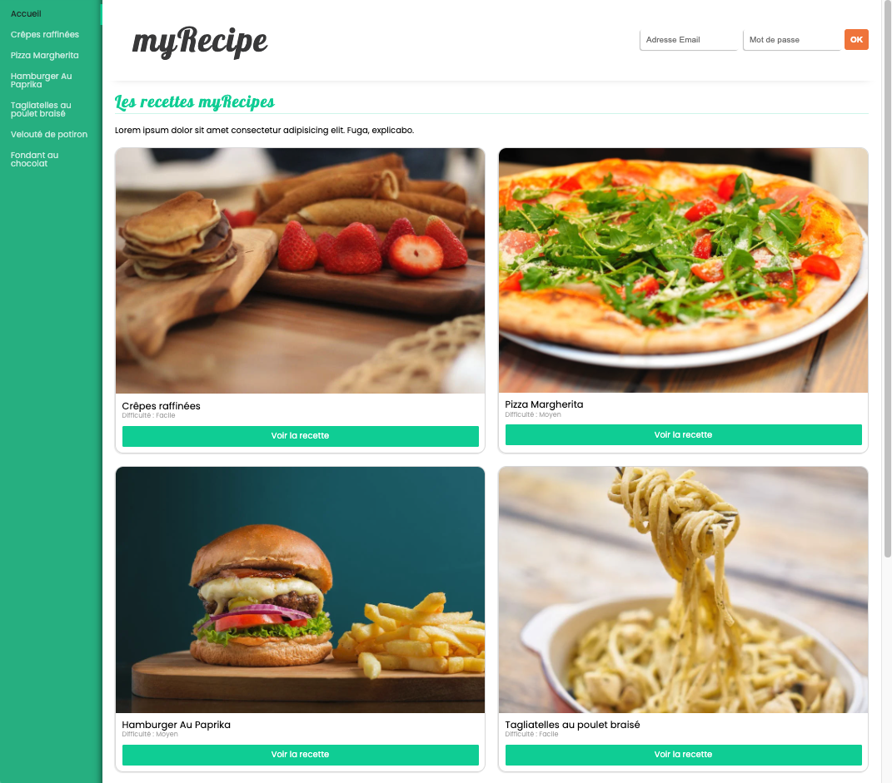

#  :spaghetti: My Recipe App

## Create a web recipes application

## Illustration

## Language/tools
- HTML5 / CSS3 / SCSS
- Javascript / REACT / Redux / Hooks
- Webpack / Babel
- PropTypes
- Axios / Middlewares

## Goals 
- Discover React (web page usage)
- Components architecture for scalable application
- Route management with react-router-dom
- Fetch data from an API
- UX / UI

## Status
Project not completed

## Context
Project carried out during my training as a web developer
